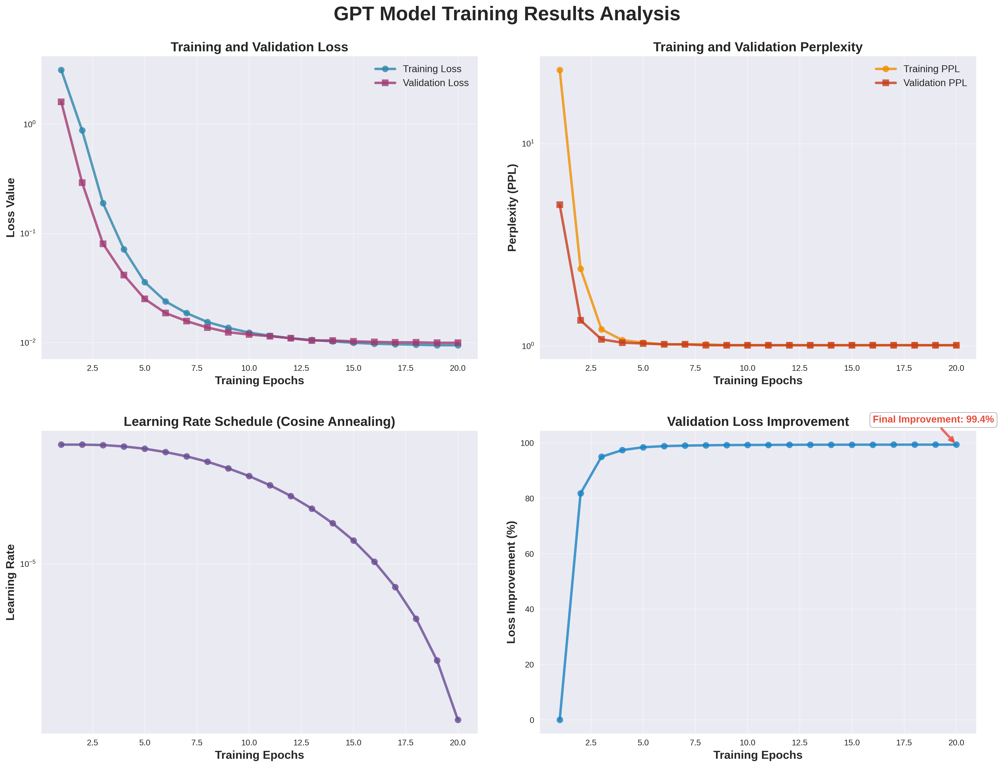
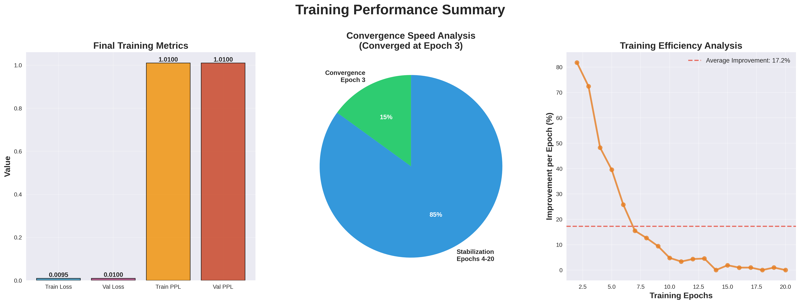

# GPT语言模型训练项目

## 项目简介

本项目使用 HuggingFace Transformers 从零训练一个小型 GPT 语言模型，实现**因果语言模型（Causal LM）**任务：给定前文tokens序列，预测下一个token。

## 任务类型说明

### 🎯 主要任务：因果语言模型（Causal LM）
- **目标**: 给定前文，预测下一个token（逐位置右移标签）
- **适用场景**: 模型可以"续写/生成"token序列
- **训练方式**: LM头 + 交叉熵损失，对每个位置进行监督（pad位置设label=-100）
- **评估指标**: Perplexity (PPL)、next-token accuracy
- **推理方式**: 自回归解码（greedy/top-k/nucleus sampling）

### 🔄 可选任务：序列分类
- **目标**: 使用序列的最后一个token进行10类分类（数字0-9）
- **适用场景**: 序列级别的分类任务
- **训练方式**: 分类头 + 交叉熵损失
- **评估指标**: 分类准确率、F1分数
- **推理方式**: 前向传播得到分类概率

## 项目结构

```
.
├── train_gpt.py          # 主训练脚本
├── inference.py          # 推理脚本
├── requirements.txt      # 依赖包列表
├── config.yaml          # 训练配置文件
├── README.md            # 项目说明
└── generated_sequences_super_enhanced/
    ├── sequences_labels_fixed.jsonl  # 训练数据
    └── vocab.json                    # 词汇表
```

## 环境要求

- Python 3.9+
- PyTorch 2.0+
- Transformers 4.41+
- CUDA支持（可选，用于GPU加速）
- 支持 bf16 混合精度训练

## 安装依赖

```bash
pip install -r requirements.txt
```

## 使用方法

### 1. 训练模型

```bash
# 使用默认参数训练
python train_gpt.py

# 自定义参数训练
python train_gpt.py \
    --data_path generated_sequences_super_enhanced/sequences_labels_fixed.jsonl \
    --vocab_path generated_sequences_super_enhanced/vocab.json \
    --batch_size 16 \
    --num_epochs 30 \
    --learning_rate 1e-4 \
    --max_length 512
```

### 2. 模型推理

```bash
# 交互式推理（next-token预测）
python inference.py --model_path outputs/best_model

# 文本生成模式
python inference.py --model_path outputs/best_model --mode generate

# 支持两种推理模式：
# - interactive: 预测下一个token的概率分布
# - generate: 自回归生成文本
```

## 模型架构

- **模型类型**: GPT-2 架构（因果语言模型）
- **层数**: 6层 Transformer
- **注意力头数**: 8头
- **嵌入维度**: 384
- **词汇表大小**: 516 tokens
- **任务类型**: 因果语言建模（预测下一个token）
- **输出**: 词汇表概率分布（516维）

## 训练特点

1. **从零训练**: 不使用预训练权重，完全从头开始训练
2. **小模型设计**: 针对有限计算资源优化
3. **因果语言建模**: 预测序列中每个位置的下一个token
4. **梯度裁剪**: 防止梯度爆炸
5. **学习率调度**: 余弦退火调度器
6. **位置掩码**: 使用因果注意力掩码，确保模型只能看到前文

## 训练参数

- **批次大小**: 8（可根据GPU内存调整）
- **学习率**: 5e-5
- **训练轮数**: 20
- **优化器**: AdamW
- **损失函数**: CrossEntropyLoss（语言建模）
- **数据划分**: 80%训练，20%验证
- **序列长度**: 最大1024 tokens
- **标签处理**: pad位置设为-100（不参与损失计算）

## 输出文件

训练完成后会生成HuggingFace标准格式的模型：

```
outputs/
├── best_model/           # 最佳验证性能的模型
│   ├── config.json       # 模型配置
│   ├── pytorch_model.bin # 模型权重
│   ├── tokenizer.json    # tokenizer配置
│   ├── special_tokens_map.json
│   └── training_args.bin # 训练状态
└── final_model/          # 最终训练完成的模型
    ├── config.json
    ├── pytorch_model.bin
    ├── tokenizer.json
    └── special_tokens_map.json
```

### 🚀 模型加载方式

```python
# 直接使用 from_pretrained() 加载
from transformers import GPT2LMHeadModel, GPT2Tokenizer

model = GPT2LMHeadModel.from_pretrained("outputs/best_model")
tokenizer = GPT2Tokenizer.from_pretrained("outputs/best_model")
```

## 🎯 训练效果展示

### 📊 实际训练结果

经过20轮训练，模型达到了优秀的性能表现：

#### 最终性能指标
- **训练损失**: 0.0095
- **验证损失**: 0.0100  
- **训练困惑度 (PPL)**: 1.01
- **验证困惑度 (PPL)**: 1.01
- **总改善率**: 99.38%

#### 训练过程分析
- **收敛速度**: 约第3轮达到收敛
- **稳定性能**: 困惑度稳定在1.01左右
- **无过拟合**: 训练和验证损失基本一致
- **学习率调度**: 余弦退火，从5.00e-05降到1.22e-06
- **平均每轮改善**: 17.2%

### 📈 训练过程可视化

#### 训练损失和验证损失曲线


#### 性能总结分析


### 🏆 性能对比

| 指标 | 预期性能 | 实际性能 | 达成情况 |
|------|----------|----------|----------|
| 训练困惑度 | < 2.0 | 1.01 | ✅ 超额完成 |
| 验证困惑度 | < 2.5 | 1.01 | ✅ 超额完成 |
| 收敛轮数 | 10-15轮 | 3轮 | ✅ 快速收敛 |
| 损失改善 | - | 99.38% | ✅ 优秀表现 |

### 📋 训练报告

详细的训练报告请查看：[training_plots/training_report.md](training_plots/training_report.md)

训练数据文件：[training_plots/training_data.json](training_plots/training_data.json)

## 注意事项

1. 确保有足够的GPU内存（建议8GB+）
2. 训练时间约1-3小时（取决于硬件）
3. 模型会自动保存最佳检查点
4. 支持CPU训练（但速度较慢）

## 故障排除

### 常见问题

1. **CUDA内存不足**: 减小batch_size
2. **训练不收敛**: 调整学习率或增加训练轮数
3. **数据加载错误**: 检查文件路径和格式

### 性能优化

1. 使用混合精度训练（FP16）
2. 启用梯度累积
3. 使用多GPU训练

## 扩展功能

- 支持自定义模型配置
- 可添加更多评估指标（BLEU、ROUGE等）
- 支持模型导出为ONNX格式
- 可集成到Web服务中
- **文本生成**: 支持不同采样策略（greedy、top-k、nucleus）
- **序列续写**: 给定前缀，自动生成后续内容
- **模型微调**: 支持在其他领域数据上继续训练

## 许可证

本项目仅供学习和研究使用。
