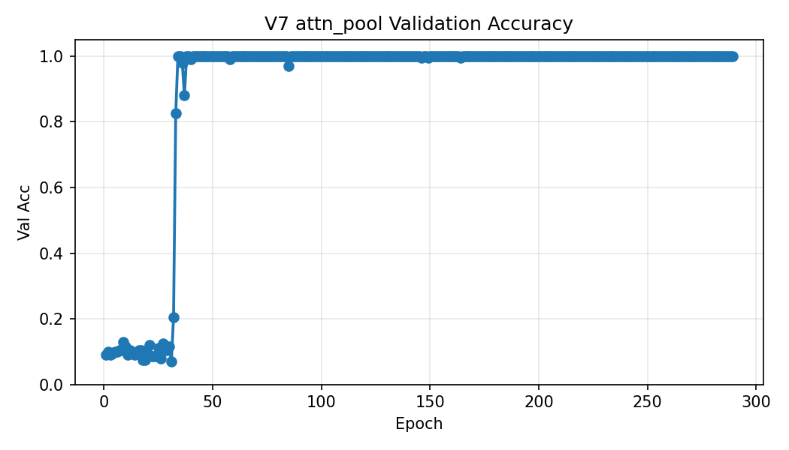

## V7 训练可视化

下图展示了 V7 的验证集成功率（val_acc）随训练轮数（Epoch）的变化趋势。

补充：混淆矩阵（验证/测试）可参考：

- 验证集混淆矩阵：`../repo_publish/docs/v7_confusion_matrix.png`
- 测试集混淆矩阵：`../repo_publish/docs/v7_test_confusion_matrix.png`

曲线与图像可用 `repo_publish/scripts/gen_visuals_v7.py` 重新生成，并可将图片复制到 `training_v7/docs/` 供 README 引用。

